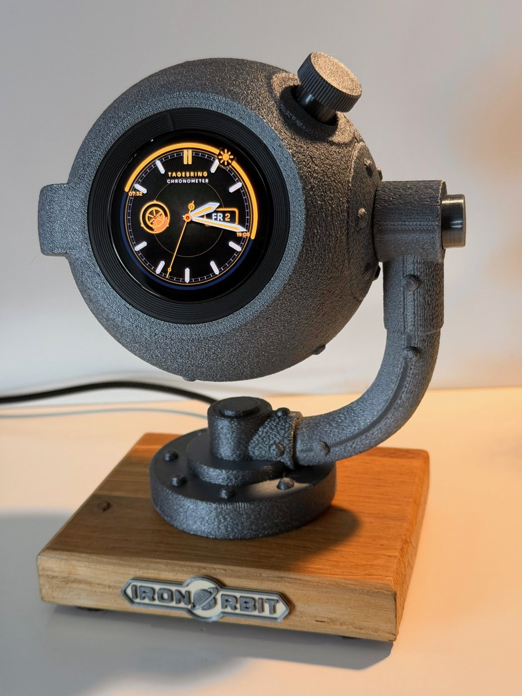
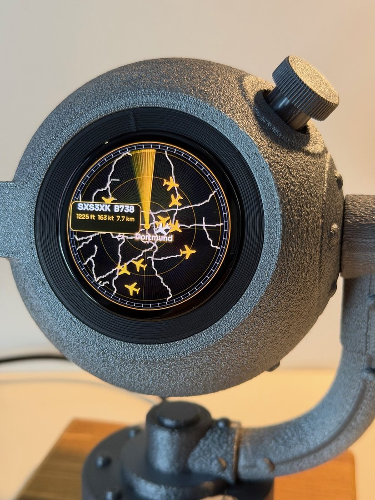
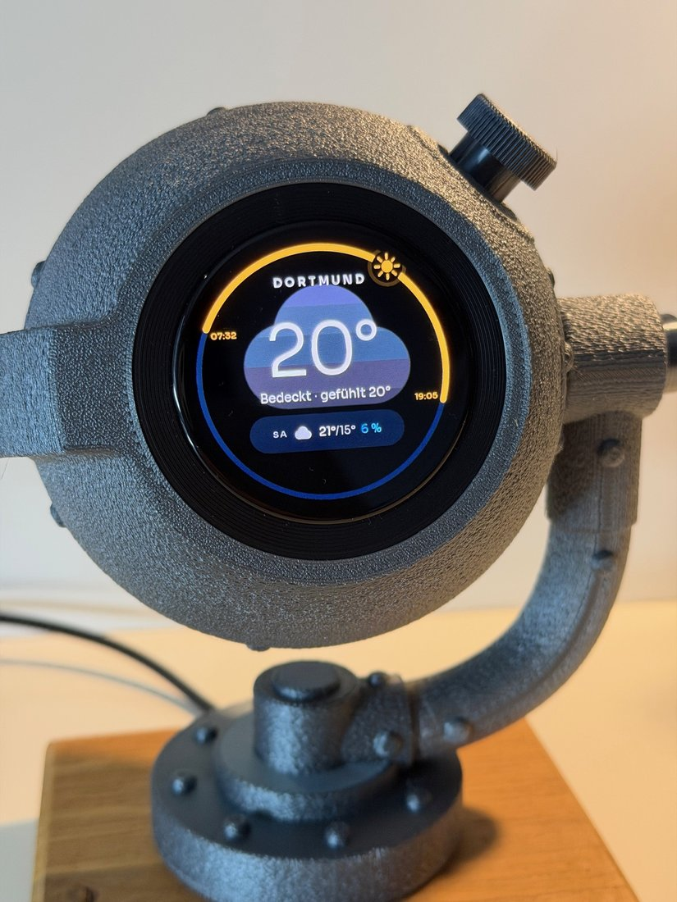
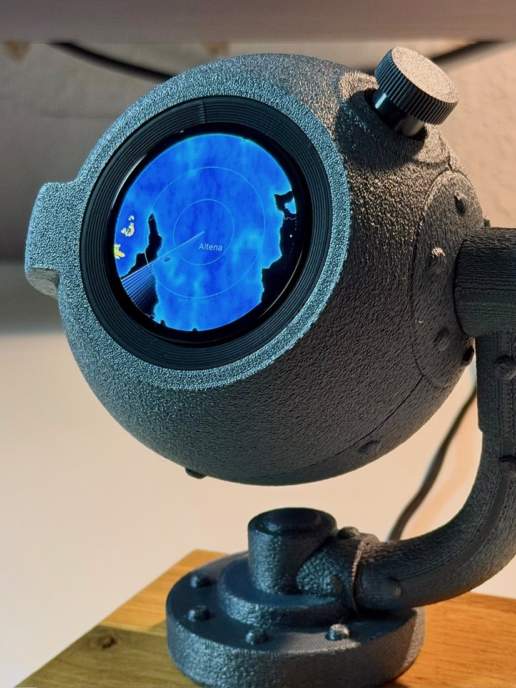

# The Orb OS

<p align="center">
  <a href="https://zionbrock.com/orb"></a>
  
  <a href="LICENSE"></a>
</p>

Firmware for **The Orb**, a round-AMOLED desk instrument: a clock, a live flight tracker
and a news screen, all dressed by SD-card themes designed in Orb Studio.

The name stands for Occasionally Relevant Ball: open firmware, open themes, occasionally
relevant.


<!-- The photographs, the GIF and the four skin screenshots that used to sit here are
     Quique Tortosa's, of HIS device, showing HIS product: an ADS-B radar with four fixed
     skins. They are still in docs/img because this is a fork and deleting a photograph
     proves nothing, but they are no longer displayed, because they are not this. When
     there are photographs of an Orb wearing a theme somebody designed, they go here. -->

## This fork

This is TechTobi's fork of Zion Brock's Orb firmware
([Ziplock78/orb-firmware](https://github.com/Ziplock78/orb-firmware)), branched from
**2.16.36**. Everything below "What it does" describes the Orb as Zion built it; this list
is what the fork adds or changes on top. Each item is its own commit, so any of them can be
taken or left on its own.

<p align="center">
  
</p>

<p align="center">
  
  
  
</p>

**New and returning apps**
- **Livestream**: a network camera full screen (MJPEG stream or JPEG snapshot URL), the URL set on the Orb itself.
- **Forecast** ("Vorhersage"): the weather forecast as a 24-hour dial.
- **Weather radar** is back in the build: rain only (no weak echoes), the full round display, 40 km, one frame every five minutes, with the town's name.
- **News** is compiled out of this build (`NEWS_ENABLED 0`).

**Getting around**
- Swipe sideways on the glass to change app (Settings stays knob-only).
- **Pull down** from the upper half of the glass to open the app menu, as rocking the knob does; it then waits 5 s for the knob.
- **Auto page**: moves to the next app after a chosen quiet time.
- **Settings → Language**: English or German for Settings, app names, status lines, weather, the date and the dial; umlauts render everywhere (`src/lang.h`, `src/font_de_*.c`).
- Place names read as the town only; the start screen holds for 5 s.

**Flight tracker**
- **Special aircraft alert**: emergency squawks, rare types (A380, An-124, Beluga, 747, B-52...), rescue helicopters, military and low passes get a sonar ping (or a siren for an emergency) and a banner. Settings → Sound → Special alert.
- No feed polling while the tracker is off screen.
- A failed route lookup is retried instead of being remembered as "no route".
- Sweep trails fade in their own colour, not through green (RGB565 quantisation).

**Clock**
- A 24-hour day ring and a weekday/date window, for themes that ask for them.
- A static clock layer can swing, for a balance wheel.
- Fixed: the sweeping second hand could crash the Orb when leaving the clock.

**WiFi**
- Remembers the last **three** networks it joined and moves to the strongest one in range on its own.
- Settings → WiFi can scan and join when the saved network is out of range, and a failed join says why (wrong password, network not found, no IP address...).

**Comfort**
- **Night mode** (Settings → Display): off, 22–07, or on; half brightness and no sound while active.

**Weather map fixes**
- No more noisy tiles and stray lines on entry; keep-out zones line up with the 466 px map.

**For theme designers**
- `livecam_plate.png` + `livecam_style.json` (`frameR`): the Livestream sits inside the theme's frame.
- `<asset>_de.png`: a German version of any picture, chosen by Settings → Language.
- Stock app names follow the language unless the theme names its apps.

**The Tagesring theme** ([`themes/techtobi/`](themes/techtobi/), drawn by [`tools/theme_techtobi.py`](tools/theme_techtobi.py)): a chronometer dial with the day ring and a swinging balance wheel, an Iron Orbit start screen, amber menus and an amber flight tracker, and the same full-size frame on the weather map and the Livestream.

**Over the cable** (`?orb ...`): `special-test`, `night`, `lang`, and `wifi` now lists the remembered networks.

### Install this fork

For an Orb built on the Waveshare ESP32-S3-Touch-AMOLED-1.75. You need a USB-C cable and Chrome or Edge on a computer; nothing to install.

1. **Download** from the [latest release](https://github.com/Techtobi83/orb-os/releases/latest), under *Assets*: `orb-os-<version>-full.bin`, and if you want the theme, `theme-tagesring-techtobi.zip`.
2. **Flash in the browser:** open Espressif's web flasher at <https://espressif.github.io/esptool-js/>, plug the Orb in, click **Connect** and pick its port. Set *Flash Address* to **`0x0`**, choose `orb-os-<version>-full.bin`, click **Program**, and wait a minute or two. The Orb restarts and asks for WiFi.
3. **Theme (optional):** unzip onto the microSD card so it holds `/themes/techtobi/`, put the card in, and choose **Tagesring** under Settings → Theme. The first start after that takes about 15 s while the artwork is prepared.

Good to know:
- The full image **erases WiFi and settings**; set them up once afterwards.
- **Updating later** without losing them: flash `orb-os-<version>-app.bin` at address **`0x10000`** instead.
- From the command line instead of the browser: `esptool.py --chip esp32s3 write_flash 0x0 orb-os-<version>-full.bin`.
- The Orb itself cannot update over WiFi in this build (that space holds theme art), so updates always go over USB.
- **Do not update from Orb Studio**: its flasher would replace this fork with Zion's firmware. Flashing Zion's firmware the same way takes you back at any time.

## What it does

Five screens, reached by rocking the knob to open the app menu and turning to choose:

- **Clock**: analogue hands over the theme's own dial, with optional date and second banners, hand shadows, a plate that can turn with a hand, and a chime on the hour if you turn that on.
- **Flight tracker**: live traffic from [adsb.lol](https://api.adsb.lol), a sweep, trails, coastlines, roads and airports, with a card for the selected aircraft and up to three readout lines the theme composes itself.
- **News**: headlines from BBC, the Guardian or NASA. Turn to move the highlight, press to read the story's own summary in the same band the list was in.
- **Livestream**: one network camera full screen, from any plain-HTTP MJPEG stream or JPEG snapshot URL (for example go2rtc's `/api/stream.mjpeg?src=NAME`), zoomed to fill the round display. See [Livestream](#livestream) below.
- **Settings**: display, location, sound, units, range, livestream URL, WiFi, theme, and About, on a knob-driven wheel.

A weather radar, a stock ticker and the older Spy Cam flip-book are in the tree but compiled out of launch one (`APPS_LAUNCH_ONE` in [`src/config.h`](src/config.h)), so they are absent from the menu rather than present and switched off.

Every one of them is dressed by a **theme**: a folder of baked artwork and JSON on the SD card, designed in [Orb Studio](https://zionbrock.com/orb) in a browser and sent over USB. Backgrounds, glass and CRT overlays, typefaces, colours, opacity, glow, layer order and layout are the theme's to choose. Themes are switched on the device itself under **Settings → Theme**, with no computer needed.

The firmware refuses a design its own build cannot render, rather than installing it and quietly drawing something else. `THEME_CAPS` in [`src/theme_style.h`](src/theme_style.h) is the ledger of what each level added, and Orb Studio holds the matching table.

## Hardware

Waveshare **ESP32-S3-Touch-AMOLED-1.75**: ESP32-S3R8 (8 MB PSRAM, 16 MB flash), **CO5300** AMOLED over QSPI, **CST9217** touch, **QMI8658** IMU, **PCF85063** RTC, **AXP2101** PMIC, **ES8311** audio + speaker, microSD. All pins are in [`src/config.h`](src/config.h), taken from the board definition rather than guessed.

The knob is the interface. Touch exists on this panel and the firmware barely uses it.

## Build and flash

```bash
pio run -e esp32-s3-amoled-175 -t upload     # build + flash over USB-C
pio device monitor -b 115200                  # serial log
```

On a first flash you may need to hold **BOOT** then tap **RESET**. On first boot the Orb asks for your WiFi on its own screen, and you pick the network and type the password with the knob. If you would rather use a phone, it also opens a network called **The Orb Setup** with a setup page.

Most flashing happens from Orb Studio's **My Orb** tab instead, which writes the same images from the browser over Web Serial and checks each region back against the chip afterwards.

Over the air, once it is on your WiFi:

```bash
pio run -e esp32-s3-amoled-175-ota -t upload   # sends to theorb.local
```

## Desktop simulator

The whole UI is portable LVGL and runs on a computer over SDL2, with a virtual knob, so a screen can be built and photographed without touching hardware:

```bash
pio run -e native -t exec     # 466x466 window (needs SDL2: brew install sdl2)
```

It reads the same theme folders from `sim/sdcard/themes/`, makes the same network requests, and has headless capture modes used to check a screen without a photograph:

```bash
.pio/build/native/program --themeshot out     # what the device renders, active theme
.pio/build/native/program --newsshot out      # the news list and a briefing
.pio/build/native/program --settingsshot out  # the settings wheel and theme picker
.pio/build/native/program --bakeshot out      # the artwork-preparing screen
.pio/build/native/program --readyshot out     # the post-update notice
```

## Configuration

`http://theorb.local/` on the same WiFi, or the device's IP, for centre point, range, brightness, sound, WiFi reset and an over-the-air firmware upload. Settings live in NVS under the `capsuleradar` namespace, which keeps its old name deliberately: renaming it would make every existing Orb look factory reset.

## Livestream

The Livestream app shows a camera whose URL you set on the Orb itself. Nothing about a camera is compiled into the firmware, so a fork can be public without publishing anybody's camera address.

Set the URL either way:

- **In a browser**: open `http://theorb.local/livestream` (or the Orb's IP followed by `/livestream`), paste the URL, press Save. This is the easy way.
- **On the device**: **Settings → Livestream**, then turn to a character and push to add it. `DEL` removes the last character, `OK` saves, `Back` leaves without saving. It opens on the saved URL, so changing a stream name or port is an edit at the end.

The new URL is used at once; no restart. An empty URL clears it, and the app then says where to set one.

What works:

- `http://` only. There is no TLS on this path.
- An MJPEG stream (`multipart/x-mixed-replace`) whose parts carry `Content-Length`, or a URL that returns a single JPEG.
- Baseline JPEG, which is what ffmpeg produces.
- **Small frames.** On a real Orb, 640x360 frames of about 6 KB stalled every few seconds, while 466x262 frames of about 3.7 KB at 3 fps ran cleanly. With [go2rtc](https://github.com/AlexxIT/go2rtc) a dedicated source does this, for example:

  ```yaml
  streams:
    garden_orb: "exec:ffmpeg -rtsp_transport tcp -i rtsp://CAMERA/STREAM -an -vf scale=466:262,fps=3 -q:v 28 -f mpjpeg pipe:1"
  ```

  and the Orb's URL is then `http://GO2RTC_HOST:1984/api/stream.mjpeg?src=garden_orb`. Use the `/api/stream.mjpeg` address, not `stream.html`, which is a player page for browsers.

The Orb's WiFi signal matters more than the camera: at around -80 dBm the stream stalls and reconnects. The serial log prints the RSSI with every reconnect.

For development only, `src/secrets.h` (gitignored; copy [`src/secrets.example.h`](src/secrets.example.h)) can hold a `LIVECAM_URL` that a freshly flashed Orb uses until one is saved on the device.

## Repo layout

```
src/
  config.h            pins, hostname, user agent, tunables
  main.cpp            boot, tasks, WiFi/NTP, web config page
  app_shell.*         the app menu and which screen owns the knob
  knob.*              quadrature decoding, detents, the rock gesture
  input_router.*      one place that decides what a turn or press means
  clock_view.*        the clock
  radar_view.*        the flight tracker scope (and the weather radar, out of launch one)
  intel_view.*        the news screen  (named intel for historical reasons)
  livecam_view.*      the Livestream app (network camera)
  settings_view.*     the settings wheel
  spycam_view.*       surveillance (out of launch one)
  theme_style.*       the theme model and THEME_CAPS
  theme_art*.*        decoding theme art and baking it into flash
  theme_font.*        per-theme converted typefaces
  orb_link.*          the USB protocol Orb Studio speaks
  update_ui.*         what the screen says while it is being worked on
  display.*           CO5300 over QSPI + LVGL bring-up
  sim_main.cpp        the SDL simulator and its capture modes
include/lv_conf.h     LVGL v8 config
web/flash/            browser web flasher (ESP Web Tools)
docs/                 architecture and the checklist for adding a screen
```

Adding or changing a screen? Read [`docs/adding-a-screen.md`](docs/adding-a-screen.md) first. A screen is a firmware feature plus a design surface in Orb Studio, and it is not finished until both agree.

## Community ports and forks

- **[Capsule Radar for the Waveshare ESP32-S3-Touch-LCD-2.1](https://github.com/alexzogh/capsule-radar/tree/port/esp32-s3-lcd-21)** by **@alexzogh (STLWarehouse)**: a port of the upstream project to the 2.1" round LCD (ST7701), with double-tap aircraft tracking, an idle clock face, and a busy-airspace query-radius fix that was merged back upstream.

## Data and licence

**Code: [MIT](LICENSE).** Fork it and build on it, keeping the notice.

The Orb OS began as a fork of [Quique Tortosa's Capsule Radar](https://github.com/socquique/capsule-radar) and carries his copyright alongside Zion Brock's. See [`LICENSE`](LICENSE) for what came from where.

Aircraft data from **adsb.lol**, free and non-commercial. First location from **ip-api.com** and city search from **Open-Meteo**'s geocoding. Map data **© OpenStreetMap contributors**, ODbL, credited on the Orb's own About screen where it cannot be switched off. Headlines from **BBC**, **The Guardian** and **NASA** RSS.
